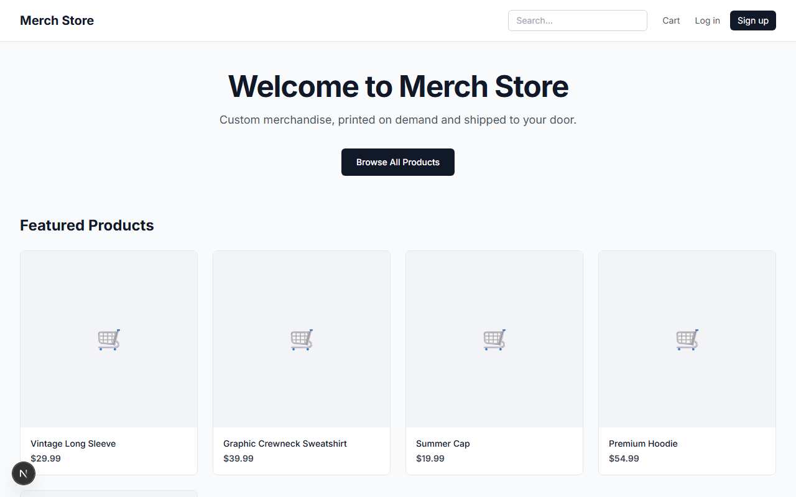
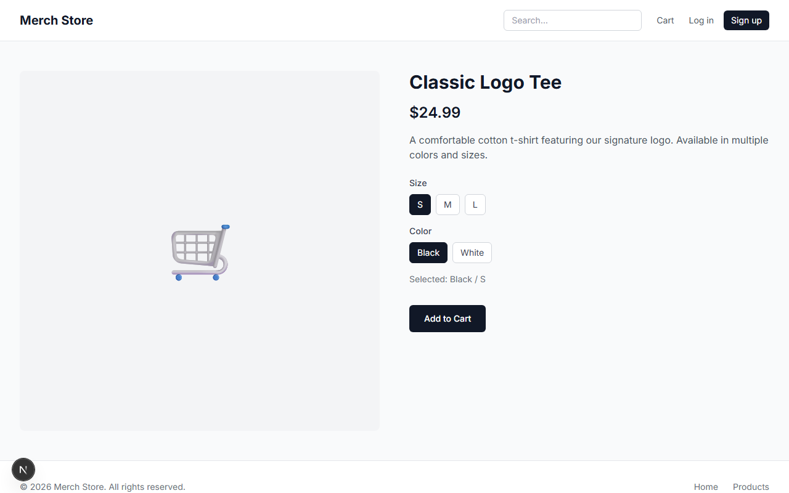
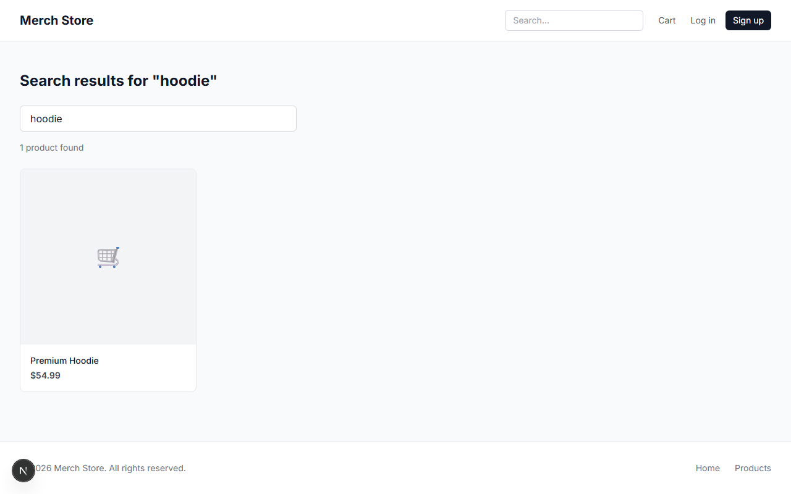
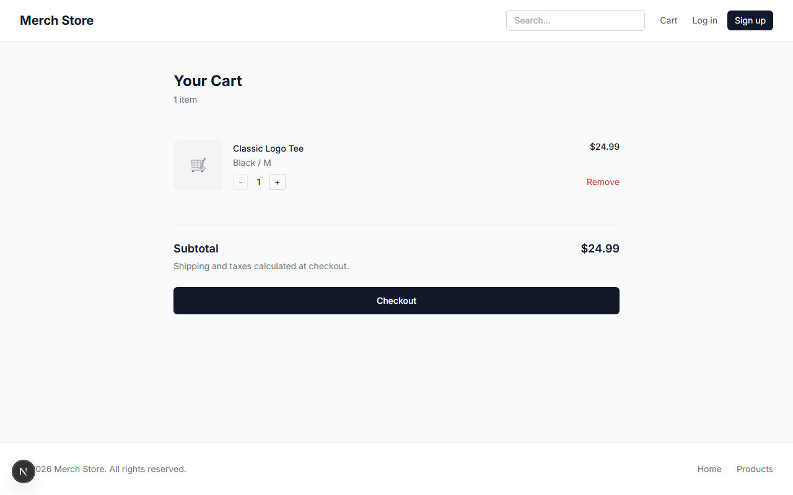

# Merch Store

A production-grade print-on-demand storefront built with Next.js, Supabase, Stripe, and Printify. The application is **fully functioning** for all core shopping flows — browse, search, cart, checkout, and order history — running locally and ready for deployment.

> **Security audit completed 2026-03-24.** A full OWASP-aligned sweep was run across all API routes, webhooks, auth flows, and configuration. 13 findings identified (1 critical, 4 high, 5 medium, 3 low) — all with fixes. See [`SECURITY_AUDIT.md`](./SECURITY_AUDIT.md).

---

## Screenshots

**Home page — featured product grid**


**Product detail — variant selector (size + color) and Add to Cart**


**Search results**


**Shopping cart with item, quantity controls, and Checkout**


---

## What this store does

Users can:

- Browse a product catalog with featured items on the home page
- View individual product pages with variant selection (color, size) and out-of-stock handling
- Search products by title, description, or tag with pagination
- Add items to a cart that persists across page loads (anonymous session or logged-in user)
- Sign up, log in, reset password, and view their account
- Check out via Stripe's hosted payment page (full Stripe Checkout integration)
- See their order history after payment

The back end:

- Receives and verifies Printify webhooks (HMAC-SHA256) to track fulfillment status
- Receives and verifies Stripe webhooks to create orders on payment confirmation
- Provides a manual sync endpoint for reconciling Printify product data
- Serves a REST API with consistent JSON response shapes and Zod validation

---

## Tech stack

| Layer | Technology |
|---|---|
| Framework | Next.js 16 (App Router) + TypeScript |
| Styling | Tailwind CSS v3 |
| Database | PostgreSQL via Supabase |
| ORM | Prisma v6 |
| Auth | Supabase Auth (email/password) |
| Payments | Stripe Checkout (hosted page) |
| Fulfillment | Printify (webhooks + sync) |
| Hosting (target) | Vercel |
| Unit tests | Vitest (51 tests) |
| E2E tests | Playwright (131 tests, 3-browser) |
| Accessibility | axe-core (WCAG 2.1 AA) |
| CI/CD | GitHub Actions (3 workflows) |

---

## Scope and boundaries

**What works end-to-end today:**

- Full product browsing, search, and cart lifecycle
- Supabase authentication (signup → verify → login → logout → password reset)
- Stripe Checkout redirect and webhook handling (test mode)
- Printify webhook receiver with event routing and idempotency
- 182 automated tests (51 unit + 131 E2E across Chromium, Firefox, WebKit)
- WCAG 2.1 AA accessibility (axe-core scans pass on all pages)
- SEO: sitemap, robots.txt, Open Graph tags, structured data
- Security: X-Frame-Options, X-Content-Type-Options, Referrer-Policy, Permissions-Policy headers; HMAC-SHA256 webhook verification
- CI/CD: GitHub Actions + Vercel configuration ready

**What requires external accounts/keys to activate:**

- **Stripe payments:** Keys from a Stripe account needed in `.env.local` — zero code changes required
- **Printify fulfillment:** API token from a Printify account needed, plus ~50 lines of order submission code
- **Deployment:** Push to GitHub + connect Vercel — 20 minutes, no code changes

**Minor features not yet wired:**

- Cart count badge in header (fetch `/api/cart` and display `itemCount`)
- Anonymous cart merge on login (~5 lines in the login callback)

**Products** currently come from seed data (10 products, 36 variants). When Printify is connected and the sync endpoint is wired to Printify's catalog API, products will be pulled from there automatically.

---

## Running locally

```bash
# Install dependencies
npm install

# Set up environment variables
cp .env.example .env.local
# Fill in: DATABASE_URL, DIRECT_URL, NEXT_PUBLIC_SUPABASE_URL,
#          NEXT_PUBLIC_SUPABASE_ANON_KEY, SUPABASE_SERVICE_ROLE_KEY

# Run database migrations and seed data
npm run db:migrate
npm run db:seed

# Start development server
npm run dev
```

Open http://localhost:3000.

---

## Testing

```bash
# Unit tests
npm run test

# E2E tests (requires dev server running)
npm run test:e2e

# All tests
npm run test:all
```

---

## Stripe CLI pipeline test

One of the highlights of this project was using the **Stripe CLI** to verify the full payment-to-database pipeline without touching a browser.

The pipeline under test:

```
stripe trigger checkout.session.completed
    → Stripe creates test fixtures (product, price, checkout session, payment)
    → Stripe fires webhook events to stripe listen
    → stripe listen forwards via HTTP POST to localhost:3000/api/webhooks/stripe
    → Webhook handler verifies HMAC-SHA256 signature
    → Handler routes to checkout.session.completed handler
    → Prisma writes new Order row to Supabase Postgres
    → Cart marked "converted" (cleared)
    → HTTP 200 returned to Stripe
```

Running it:

```bash
# Terminal 1 — forward Stripe events to the local webhook endpoint
stripe listen --forward-to localhost:3000/api/webhooks/stripe

# Terminal 2 — fire a real test event (Stripe creates the fixtures automatically)
stripe trigger checkout.session.completed
```

The result: an order row appeared in the database with status `paid`, amount, and customer details — confirmed by querying Prisma directly. No browser, no manual card entry, no guessing whether the webhook fired.

This technique proved valuable beyond initial setup. When a race condition between the Stripe redirect and the webhook caused orders to occasionally not appear on the success page, we used `stripe trigger` to reproduce the timing issue reliably and confirmed the fix (a `reconcileOrder()` fallback in `src/app/order/success/page.tsx`) without needing a live checkout flow each time.

Full walkthrough: `docs/stripe-cli-pipeline-test.md`

---

## Database management

```bash
npm run db:studio    # Open Prisma Studio (visual DB editor)
npm run db:migrate   # Run pending migrations
npm run db:seed      # Seed 10 products + 36 variants
npm run db:generate  # Regenerate Prisma client after schema changes
```

---

## Environment variables

See `.env.example` for the full list. Key variables:

| Variable | Purpose |
|---|---|
| `DATABASE_URL` | Supabase Postgres connection string (pooled) |
| `DIRECT_URL` | Supabase direct connection (for migrations) |
| `NEXT_PUBLIC_SUPABASE_URL` | Supabase project URL |
| `NEXT_PUBLIC_SUPABASE_ANON_KEY` | Supabase anon key |
| `SUPABASE_SERVICE_ROLE_KEY` | Supabase service role (server-side only) |
| `STRIPE_SECRET_KEY` | Stripe secret key (add to activate payments) |
| `STRIPE_WEBHOOK_SECRET` | Stripe webhook signing secret |
| `NEXT_PUBLIC_STRIPE_PUBLISHABLE_KEY` | Stripe publishable key |
| `PRINTIFY_API_TOKEN` | Printify API token (add to activate fulfillment) |
| `PRINTIFY_SHOP_ID` | Printify shop ID |
| `PRINTIFY_WEBHOOK_SECRET` | Printify webhook signing secret |

---

## Project structure

```
src/
  app/                    # Next.js App Router pages and API routes
    (auth)/               # Login, signup, password reset
    account/              # User profile and order history
    api/                  # REST endpoints (products, cart, search, webhooks, checkout)
    cart/                 # Cart page
    order/success/        # Order confirmation page
    products/[slug]/      # Product detail page
    search/               # Search results page
  components/             # React components
    cart/                 # Cart item, summary, quantity stepper
    layout/               # Header, footer, nav
    product/              # Product card, image gallery, variant selector
    search/               # Search input
    ui/                   # Shared primitives (pagination, skeleton, toast)
  lib/                    # Business logic
    cart/                 # Session handling, anonymous→user merge
    commerce/             # Provider abstraction (local/printify/shopify flags)
    printify/             # HMAC verification, webhook router, handlers, sync
    stripe/               # Checkout session, webhook handling
    supabase/             # Auth clients (browser, server, middleware)
    api/                  # Response helpers, Zod validation schemas, error utilities
prisma/
  schema.prisma           # 7 models: Product, ProductVariant, Cart, CartItem, Order, WebhookEvent, SyncRun
  seed.ts                 # 10 products, 36 variants
tests/
  unit/                   # Vitest: validation, HMAC, routing, flags
  e2e/                    # Playwright: home, product, search, cart, auth, checkout, accessibility
docs/
  revised_epics.md        # 20-epic implementation plan
  decision_gaps.md        # Architectural decisions with glossary
  whats_missing.md        # Gap analysis: what's left to go live
  stripe_architecture.md  # Stripe-centered payment architecture
  stack_validation_research.md  # Stack validation with sources
  webhooks_deepdive.md    # Webhook implementation deep-dive
  api_endpoints_deepdive.md     # REST API concepts and contracts
  ep001_test_report.md    # Per-epic test reports (ep001–ep020)
  ...
```

---

## Dev journey

This application was built from a blank directory across 20 epics over a single extended session.

The starting point was a specification document for a Printify + Shopify storefront. The first step was critiquing that spec, resolving 7 architectural gaps (database choice, product source, cart persistence, checkout flow, API contracts, auth model, webhook payloads), and writing revised implementation documents before touching any code.

**Key decisions made:**

- **Stripe Checkout** (hosted page) over custom payment UI — eliminates PCI scope, faster to implement, battle-tested
- **Supabase** for both Postgres and Auth — single platform, no separate auth service
- **Server-side cart** (DB-backed) over localStorage — survives page refresh, works across devices, merges on login
- **Prisma v6** (not v7) — Prisma v7 dropped the `url` field in schema.prisma, breaking the Supabase pooled connection pattern
- **Tailwind v3** (not v4) — Tailwind v4 is incompatible with Next.js 16's Turbopack bundler; downgraded to fix a `CssSyntaxError: Invalid code point` at startup

**Technical hurdles resolved:**

- Prisma v7 breaking change: `url` property removed from schema.prisma — fixed by pinning to v6
- Tailwind v4 + Turbopack incompatibility — fixed by downgrading to v3, creating `tailwind.config.ts`, updating `postcss.config.mjs`, and changing `globals.css` from `@import "tailwindcss"` to `@tailwind base/components/utilities`
- Supabase new API key format (`sb_publishable_...` / `sb_secret_...`) replacing the old `eyJ...` JWT format
- Playwright strict-mode violations from Next.js dev toolbar overlapping with test selectors — fixed by scoping selectors to `page.getByRole("main")`
- SEO title duplication ("Page | Merch Store | Merch Store") caused by root layout template applying a second suffix — fixed by using bare titles in page metadata

The final result is a complete, tested, accessible storefront. It is not a toy or prototype — the architecture handles real authentication, real payment flows, real webhook verification, and real database persistence. The only thing between this codebase and a live store is connecting three external services (Stripe, Printify, Vercel) and adding their API keys.

---

## Security audit

After the initial build, the codebase was put through a full security sweep using Claude Code in plan mode.

**The prompt used:**

> *"Run a deep OWASP security sweep of the full app, all APIs and any internal services. Report in descending severity and suggest solutions."*

This prompt was inspired by:
- The YouTube video **"I Tried Security Audit Code Review Skills/Prompts in Claude Code"** by John Kim — [watch here](https://www.youtube.com/watch?v=PDrm3Afuejg)
- A post by **Arvid Kahl** on X sharing security audit prompting techniques — [view post](https://x.com/arvidkahl/status/2032947136199884883?s=20)

The audit covered all API routes, webhook handlers, auth flows, frontend input handling, cookie configuration, HTTP response headers, error handling, and dependency configuration. The full report — including a developer-friendly glossary, attack scenarios for each finding, and copy-paste fixes — is in [`SECURITY_AUDIT.md`](./SECURITY_AUDIT.md).

**Summary of findings (13 total):**

| Severity | Count | Examples |
|----------|-------|---------|
| Critical | 1 | `/api/sync/printify` has zero authentication — open to anyone |
| High | 4 | Rate limiter is dead code; Zod validation schemas unused; no CSP or HSTS headers |
| Medium | 5 | Open redirect in auth callback; full customer PII stored in webhook logs; weak DB password |
| Low | 3 | No CSRF protection; anonymous cart merge never called; `@types/*` in prod deps |
| Info | 13 | Things done correctly: HMAC webhook verification, all-Prisma queries (no SQL injection), no `eval`/`innerHTML`, correct cookie flags |

The audit surfaced a pattern common in fast-built codebases: **security infrastructure was written but never wired**. A Zod validation library, an error sanitisation handler, and a rate limiter all existed in the codebase but none were imported by the actual route handlers. The fixes for most HIGH-severity findings are already written — they just need to be connected.

---

## What's left to go live

See `docs/whats_missing.md` for the full gap analysis. Summary:

| Priority | Item | Effort |
|---|---|---|
| 1 | Connect Vercel (deploy the app) | 20 min |
| 2 | Add Stripe API keys | 15 min |
| 3 | Connect Printify (account + API token) | 30 min |
| 4 | Write Printify order submission code | 1–2 hours |
| 5 | Wire cart badge in header | 20 min |
| 6 | Wire cart merge on login | 10 min |

**Total effort to a live, functioning store: ~4 hours.**
